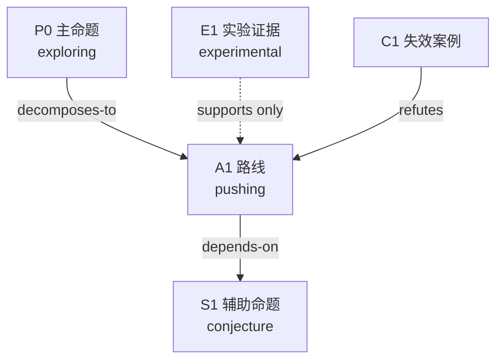

# 研究树

## 当前状态
- 主命题：
- 当前主路线：
- 最新关键事件：
- 最大障碍：
- 下一步：

## 路线图

```mermaid
flowchart TD
    P0["P0 主命题<br/>exploring"]
    A1["A1 路线<br/>pushing"]
    S1["S1 辅助命题<br/>conjecture"]
    E1["E1 实验证据<br/>experimental"]
    C1["C1 失效案例"]
    P0 -->|decomposes-to| A1
    A1 -->|depends-on| S1
    E1 -.->|supports only| A1
    C1 -->|refutes| A1
```

## 分支卡片
### A1 — 名称
- 状态：pushing / blocked / partial-result
- 核心直觉：
- 有序子目标：
- 支持证据（台账 ID）：
- 当前障碍与失败类型：
- 下一步：
